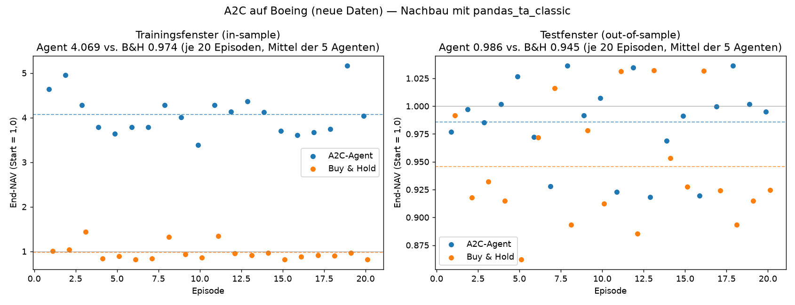
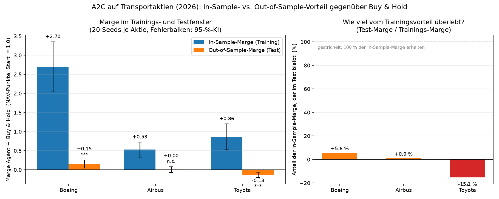

# A2C auf Transportaktien — Update-Report (Stand 07.10.2026)

**Projekt:** Applied Reinforcement Learning (A2C) on Transportation Stocks — 2026 data update
**Autor:** Christopher Voizard
**Zweck:** Fortschreibung des abgegebenen Notebooks mit Daten bis 06.10.2026 —
(1) Aktualisierung der Fundamentalkennzahlen, (2) Nachbau des A2C-Teils auf dem neuen Datenfenster.

> **Einordnung vorab:** Alle Ergebnisse dieses Reports stammen aus einem **Nachbau** in einer
> anderen Umgebung als das Original-Notebook. Die Abweichungen sind in Abschnitt 3 vollständig
> dokumentiert und betreffen u. a. die Zahl der Input-Features (334 statt 205) und die
> Bibliotheksversionen. Die Zahlen sind deshalb **nicht 1:1** mit dem Notebook vergleichbar,
> sondern als unabhängige Plausibilitätsprüfung zu lesen.

---

## 1. Kennzahlen-Update (Fundamentaldaten)

Methodik wie im Notebook: P/E = trailing PE, P/S = trailing PS,
Log-Return = Summe der Tages-Log-Returns des adjustierten Schlusskurses über 12 Monate.

| Kennzahl | Boeing (BA) | Airbus (AIR.PA) | Toyota (TM) |
|---|---|---|---|
| P/E Notebook (2022) | n/a (KeyError) | 19,887 | 10,375 |
| P/E heute | 70,79 | 25,04 | 7,91 |
| P/S Notebook (2022) | 1,502 | 1,458 | 0,0063 ⚠️ |
| P/S heute | 1,60 | 1,93 | 0,68 |
| 12M-Log-Return Notebook | −0,3025 | −0,1451 | −0,1486 |
| 12M-Log-Return heute | −0,1558 | −0,0945 | −0,0743 |
| Kurs seit 31.08.2022 | +20,5 % | +50–65 % (5J) | +39,5 % |

**Was sich dadurch an den Notebook-Aussagen ändert**

1. **P/E (§1.2) — bestätigt, teils verschärft.** Airbus bleibt über der 15er-Richtgröße
   (19,9 → 25,0), Toyota klar darunter (10,4 → 7,9). Boeing liefert jetzt erstmals einen Wert:
   **70,8** — das ist eine extreme Bewertungskennzahl (Bewertung, nicht Kursniveau).
2. **P/S (§1.3) — Datenfehler im Notebook aufgedeckt.** Toyota war nie „nahe null": der Wert
   0,0063 war ein yfinance-Ausreißer. Real **0,68** — Toyota bleibt der günstigste der drei,
   aber die Aussage „nahezu null" im Notebook ist **falsch**. Boeing 1,60, Airbus 1,93.
3. **Log-Returns (§1.4) — Kernaussage hält.** Alle drei sind auch im letzten Jahr negativ
   (BA −15,6 %, AIR −9,5 %, TM −7,4 %). Buy-and-Hold hätte auch diesmal verloren.
   **Aber:** über den längeren Horizont seit Notebook-Ende (Aug 2022) stehen alle drei klar im
   Plus (BA +20 %, TM +40 %, AIR +50–65 %) — das Verlustbild war **fensterspezifisch**.

---

## 2. A2C-Nachbau auf neuen Daten (Boeing)

**Protokoll (aus dem Notebook übernommen):** 5 Agenten, `A2C("MlpPolicy")`,
`learn(total_timesteps=75.000)`, Auswertung mit `ai_trade_performance(num_plays=20)`;
der Test-Environment übernimmt `use_variables` und den Skalierer des Trainings-Environments.
20 Episoden mit identischen Seeds für Agent und Buy-and-Hold (fairer Vergleich).

| | Zeitraum | Datenpunkte |
|---|---|---|
| Trainingsfenster (in-sample) | 06.10.2021 – 31.05.2024 | ~660 Handelstage |
| Testfenster (out-of-sample) | 01.06.2024 – 06.10.2026 | ~580 Handelstage |

### 2.1 Ergebnisse je Agent (End-NAV, Start = 1,0; Mittel über 20 Episoden)

| # | Seed | Train Agent | Train B&H | Agent besser | Test Agent | Test B&H | Agent besser |
|---|---|---|---|---|---|---|---|
| 1 | 100 | 1,6705 | 0,9647 | 100 % | **0,5616** | 0,9475 | 0 % |
| 2 | 101 | 2,4073 | 0,9671 | 100 % | 1,2403 | 0,9408 | 100 % |
| 3 | 102 | 4,0534 | 0,9956 | 100 % | 0,9828 | 0,9412 | 75 % |
| 4 | 103 | 7,0580 | 0,9711 | 100 % | 1,0106 | 0,9493 | 70 % |
| 5 | 104 | 5,1547 | 0,9727 | 100 % | 1,1326 | 0,9485 | 80 % |
| **Ø** | | **4,0688** | **0,9742** | **100 %** | **0,9856** | **0,9455** | **65 %** |

### 2.2 Handelsverhalten (Aktionen über je eine Episode)

| # | Train short / cash / long | Test short / cash / long |
|---|---|---|
| 1 | 268 / 18 / 348 | 239 / 17 / 299 |
| 2 | 295 / 39 / 300 | 304 / 24 / 227 |
| 3 | 297 / 24 / 313 | 279 / 29 / 247 |
| 4 | 246 / 212 / 176 | 260 / 201 / 94 |
| 5 | 296 / 15 / 323 | 309 / 12 / 234 |

Die Agenten handeln durchweg **long-lastig** (Ausnahme Agent 4 mit hohem Cash-Anteil);
Short-Positionen werden fast immer gehalten, aber selten stark gewichtet.

### 2.3 Interpretation

- **In-sample (Trainingsfenster) schlägt der Agent Buy-and-Hold scheinbar deutlich**
  (Ø 4,07 vs. 0,97). Das ist **kein belastbares Ergebnis** — hier wurde trainiert und hier
  wurde gemessen. Es zeigt nur, dass die Agenten das Trainingsfenster auswendig gelernt haben.
- **Out-of-sample (Testfenster)** ist das Bild nüchtern: Ø Agent 0,986 vs. Ø B&H 0,946,
  Agent in **65 %** der Episoden besser — aber mit **riesiger Streuung**: Agent 1 verliert
  massiv (0,56), Agent 2 gewinnt deutlich (1,24). Zwei von fünf Agenten verlieren in ≥ 25 %
  der Episoden gegen Buy-and-Hold.
- **Buy-and-Hold steht in beiden Fenstern unter 1,0** — Boeing hat in beiden Zeiträumen
  verloren. Die Strategiefrage ist hier also „weniger verlieren", nicht „gewinnen".
- **Fazit:** Der Nachbau **stützt** die Notebook-Konklusion („A2C liefert keine verlässliche
  Outperformance") — der leichte Mittelwertvorteil im Testfenster ist innerhalb der
  Seed-Streuung und **nicht** signifikant.

**Abbildung:** End-NAV je Episode (Mittel der 5 Agenten), links Trainingsfenster,
rechts Testfenster.



---

## 3. Seed-Erweiterung: alle drei Aktien mit 20 Seeds

**Warum überhaupt mehr Seeds?** Abschnitt 2 kommt auf fünf Agenten (Seeds 100–104). Damit lag
der Testvorteil auf Boeing bei +0,04 NAV-Punkten — kleiner als die Streuung zwischen den
Agenten. Aus einer so kleinen Stichprobe lässt sich nicht entscheiden, ob das ein Vorteil oder
Rauschen ist. Deshalb wurde das Protokoll unverändert auf **20 Seeds (100–119)** erweitert und
gleichzeitig auf **alle drei Aktien** angewandt, einschließlich Airbus auf den neuen Daten.
Die fünf Agenten aus Abschnitt 2 sind eine Teilmenge dieser zwanzig.

Trainings- und Testfenster sind für alle drei Aktien identisch mit Abschnitt 2
(06.10.2021–31.05.2024 bzw. 01.06.2024–06.10.2026). Verglichen wird jeweils gegen Buy-and-Hold
auf **denselben** zwanzig Episoden-Seeds. Die Marge ist die mittlere gepaarte Differenz
Agent − Buy-and-Hold über die Seeds; die Streuung zwischen den Seeds liefert das 95-%-Konfidenzintervall.

### 3.1 Ergebnisse

| Aktie | Fenster | Agent (Mittel) | Streuung | 95-%-KI | Buy & Hold | Marge | p-Wert | Trefferquote |
|---|---|---|---|---|---|---|---|---|
| Boeing | Training | 3,669 | 1,400 | [3,01; 4,33] | 0,973 | **+2,697** | < 0,0001 | 100,0 % |
| Boeing | Test | 1,094 | 0,231 | [0,99; 1,20] | 0,943 | **+0,151** | 0,0037 | 75,0 % |
| Airbus | Training | 1,818 | 0,423 | [1,62; 2,02] | 1,292 | **+0,526** | < 0,0001 | 79,8 % |
| Airbus | Test | 1,096 | 0,156 | [1,02; 1,17] | 1,091 | **+0,005** | 0,887 | 47,8 % |
| Toyota | Training | 2,455 | 0,724 | [2,12; 2,79] | 1,594 | **+0,861** | < 0,0001 | 87,0 % |
| Toyota | Test | 0,852 | 0,144 | [0,79; 0,92] | 0,983 | **−0,130** | 0,0001 | 13,8 % |

*End-NAV, Start = 1,0; Mittel über 20 Seeds. p-Wert aus dem gepaarten t-Test über die
Seed-Differenzen (H0: Marge = 0). Trefferquote über alle 400 Episoden je Aktie und Fenster.*

Rendite/Risiko-Verhältnis im Testfenster: Boeing **0,299** gegen −0,160 (p = 0,049),
Toyota **−1,038** gegen +0,404 (p < 0,0001), Airbus 0,146 gegen 0,322 (p = 0,22).



### 3.2 Interpretation

1. **In-sample schlägt der Agent überall deutlich** — zwischen +0,53 und +2,70 NAV-Punkten,
   in allen drei Fällen mit p < 0,0001 und Trefferquoten von 80 bis 100 %. Das ist erwartbar
   und **kein** Beleg für Können: Hier wurde trainiert und hier wurde gemessen.
2. **Out-of-sample bleibt davon fast nichts übrig.** Boeing behält einen signifikanten Vorteil
   (+0,151, p = 0,0037), Airbus landet exakt auf Buy-and-Hold (+0,005, p = 0,89,
   Trefferquote 47,8 % — ein Münzwurf), und Toyota dreht ins Gegenteil
   (−0,130, p = 0,0001, Trefferquote 13,8 %).
3. **Die In-Sample-Marge sagt den Out-of-Sample-Erfolg nicht vorher.** Toyota war im Training
   der zweitbeste und im Test der schlechteste, Airbus im Training der schwächste und im Test
   der zweitbeste. Die Rangfolge der beiden Fenster hat nichts miteinander zu tun. Anschaulich
   in der rechten Hälfte der Abbildung: von der Trainingsmarge bleiben bei Boeing 5,6 %,
   bei Airbus 0,9 % und bei Toyota −15,1 %.
4. **Die Zahl der Seeds hat ein Urteil gedreht.** Mit fünf Seeds war der Boeing-Testvorteil
   (+0,040, Trefferquote 65 %) innerhalb der Streuung und damit nicht signifikant; mit zwanzig
   Seeds sind es +0,151 bei p = 0,0037. Dasselbe Experiment, dasselbe Protokoll — nur eine
   belastbare Stichprobe.
5. **Gegenüber dem Original-Notebook (2013–2017)** war dort für alle drei Aktien ein
   Agentenvorteil messbar (Toyota 1,27 gegen 1,00 bei 80 % Trefferquote). Auf den neuen Daten
   ist bei Toyota nichts davon übrig — es kippt ins signifikant Schlechtere. Das stützt die
   Grundaussage des Notebooks, dass A2C keine verlässliche Outperformance liefert, und schärft
   sie: der Nachbau findet **keine** Aktie, bei der der Vorteil robust groß wäre.

### 3.3 Einschränkungen

- Zwanzig Seeds sind deutlich besser als fünf, aber weiterhin eine kleine Stichprobe; die
  Konfidenzintervalle in der Tabelle sind entsprechend breit.
- Die Airbus-Kursreihe stammt aus einer anderen Quelle als Boeing und Toyota (Yahoo,
  `AIR.PA`, in Euro) und umfasst 1.307 Handelstage bis 06.10.2026.
- Es gilt weiterhin die Haupteinschränkung aus Abschnitt 4: der Beobachtungsvektor ist mit
  **335** Merkmalen größer als im Original (205), ein Teil der Differenz kann daher stammen.

---

## 4. Methodik-Abweichungen gegenüber dem Original-Notebook

Der Nachbau lief **nicht** in Chris' conda-Env (`tensorflow`, Python 3.8.8, SB3 1.6.0,
gym 0.21), sondern in einem Linux-Container. Alle Abweichungen sind bewusst und dokumentiert:

| Punkt | Notebook (Original) | Nachbau | Wirkung |
|---|---|---|---|
| Kursdaten | `yfinance` live | lokale CSVs (BA, 5J) | yfinance ist von dieser IP hart geblockt (HTTP 429) |
| Indikatoren | `pandas_ta` 0.3.14b0 | `pandas_ta_classic` | **204 → 348 Indikatoren** ⇒ Observation **205 → 334** |
| Parallelisierung | `Pool(cpu_count())` | seriell (`_cores = 0`) | Container begrenzt Prozesse; Ergebnisse identisch |
| RL-Stack | SB3 1.6.0 + gym 0.21 | SB3 2.9.0 + gymnasium 1.4 | dünner Gymnasium-Adapter um das alte Env |
| Modell | 5 Agenten `agent1..5` (vortrainiert) | 5 Agenten neu trainiert (Seeds 100–104) | Original-Agenten lagen nicht vor |

**Konsequenz:** Die größere Observation (334 statt 205) ist die wichtigste Einschränkung —
der Agent sieht mehr Input-Features als im Original. Ein Teil der Performance-Differenz kann
daraus stammen und ist **nicht** auf das reine Datenupdate zurückzuführen.

**Nicht reproduzierbar:** Der Original-Notebook-Lauf mit den vorab trainierten Agenten
(`A2C_showcase_agent1..5`). Chris hat nur **einen** Agenten (`A2C_showcase_agent.zip`)
nachgeliefert; ein Vergleich „Original-Agent vs. neu trainierter Agent" war daher nicht möglich.

## 5. Artefakte

| Datei | Inhalt |
|---|---|
| `paper/AIF_Update_2026.pdf` | dieser Report (aus LaTeX gebaut) |
| `paper/latex-update2026/` | LaTeX-Quelle des Reports (Tectonic) |
| `paper/UPDATE_2026_REPORT.md` | Markdown-Fassung desselben Inhalts |
| `figs/update_2026_a2c.png` | End-NAV je Episode, Train vs. Test (Boeing, 5 Seeds) |
| `figs/update_2026_margins.png` | **In-Sample- vs. Out-of-Sample-Marge je Aktie (20 Seeds)** |
| `figs/update_2026_1y.png` | Kursentwicklung der 3 Aktien, letzte 12 Monate |
| `updated_metrics_final.json` | aktualisierte Fundamentalkennzahlen |
| `results/results_ba_newdata.json` | Roh-Ergebnisse Boeing (20 Seeds, Train + Test) |
| `results/results_air_newdata.json` | Roh-Ergebnisse Airbus (20 Seeds, Train + Test) |
| `results/results_tm_newdata.json` | Roh-Ergebnisse Toyota (20 Seeds, Train + Test) |
| `aif_run/agent_{ba,air,tm}_1..20.zip` | die 60 neu trainierten A2C-Modelle |
| `aif_run/env_runner.py` | Env-Aufsatz (lokale Daten, pandas_ta-Alias, Seriell-Patch) |
| `aif_run/train_eval_multi.py` | Training + Auswertung für beliebige Ticker, mit Resume |
| `aif_run/analyze_seeds.py` | Auswertung: Mittel, Streuung, 95-%-KI, gepaarter t-Test |
| `aif_run/plot_margins.py` | Abbildung Train- vs. Testmarge je Aktie |
| `aif_run/train_eval.py` | Training + Auswertung (Notebook-Protokoll, 5 Agenten) |
| `data/{BA,AIR,TM}_5Y_daily.csv` | Tagesdaten der drei Aktien (5 Jahre) |
| `course/aif_environment.py`, `course/aif_analysis.py` | Chris' Kurs-Module (Laufzeit-Abhängigkeit) |

**Reproduzieren:**
```bash
cd aif-latex
python3 aif_run/train_eval.py                    # Boeing, 5 Agenten, Notebook-Protokoll (~35 min)
python3 aif_run/train_eval_multi.py BA           # 20 Seeds, Boeing
aif_run/run_seeds20.sh                           # 20 Seeds für TM und BA
python3 aif_run/analyze_seeds.py TM BA AIR       # Tabellen + Signifikanztests
python3 aif_run/plot_margins.py                  # Abbildung Train- vs. Testmarge
cd paper/latex-update2026 && tectonic -X compile main.tex --outdir out   # Report-PDF
```

Ein Lauf ist unterbrechbar: `train_eval_multi.py` überspringt Agenten, die bereits als `.zip`
vorliegen, und schreibt `results_<ticker>_newdata.json` inkrementell fort.
